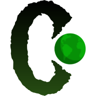

# COIDON Puzzle

<table border="0">
 <tr>
    <td></td>
    <td>COIDON, the Conservation of Integrity & Diversity of Nature is a slide puzzle game to spread awareness about threatened species across the globe. More than 40k species are threatened with extinction.</td>
 </tr>
</table>


![Photo Booth Header][logo]

Devpost Link: https://devpost.com/software/coidon-puzzle

Live Demo: 

## Inspiration
More than 40,000 species are threatened with extinction. That is still 28% of all assessed species. An endangered species is a species that is very likely to become extinct in the near future, either worldwide or in a particular political jurisdiction. Endangered species may be at risk due to factors such as habitat loss, poaching and invasive species. The International Union for Conservation of Nature (IUCN) Red List lists the global conservation status of many species, and various other agencies assess the status of species within particular areas. This made me think, what can I do about this? How can I help? Spreading awareness about these species and why they're so close to extinction.

## What it does
The COIDON app is a sliding puzzle that challenges a player to slide (frequently flat) pieces along certain routes (on a virtual board) to establish a picture of a species. The pieces to be moved consist of "imprinted" sections of a larger picture (like a jigsaw puzzle). The goal of this puzzle is to solve this puzzle as quickly as possible and **more importantly** learn about these endangered species and what can you do to save them.

## How we built it
Of course, this puzzle was built on top of the Dashatar slide puzzle developed by Very Good Ventures and team. Kudos to them. On of that, I did extensive research on these endangered species to learn about them and how can I redesign this puzzle challenge to be more informative and entertaining at the same time.

## Challenges we ran into
Understanding a new code base is often challenging but over time, I got used to it.

## Accomplishments that we're proud of
Working with BloC state management is an accomplishment for sure as it does complicate things a bit in my opinion but I got to learn more about it along this journey so it was fun. Being able to use this topic for this challenge is one of the biggest accomplishments that I'm certainly proud of as I closely support the mission of protecting endangered species and our planet. 

## What we learned
As I said, best practices around Flutter (always love it), BloC state management, and a lot more about endangered species. For instance, I didn't know that "spiders can fly" and there is a "fish that can walk". So, it've been a fantastic experience.

## What's next for COIDON Puzzle
COIDON puzzle app will continue after this challenge and I'm planning on adding more species to the game and possibly a leaderboard with scores.

*Modified by Dhruvil Patel (Github: @dhruvilp)*

*Built by [Very Good Ventures][very_good_ventures_link] in partnership with Google.*
*Created using [Very Good CLI][very_good_cli_link].*

---

## Getting Started 🚀

To run the project either use the launch configuration in VSCode/Android Studio or use the following command:

```sh
$ flutter run -d chrome
```

---

## Running Tests 🧪

To run all unit and widget tests use the following command:

```sh
$ flutter test --coverage --test-randomize-ordering-seed random
```

To view the generated coverage report you can use [lcov](https://github.com/linux-test-project/lcov).

```sh
# Generate Coverage Report
$ genhtml coverage/lcov.info -o coverage/

# Open Coverage Report
$ open coverage/index.html
```

---

## Working with Translations 🌐

This project relies on [flutter_localizations][flutter_localizations_link] and follows the [official internationalization guide for Flutter][internationalization_link].

### Adding Strings

1. To add a new localizable string, open the `app_en.arb` file at `lib/l10n/arb/app_en.arb`.

```arb
{
    "@@locale": "en",
    "counterAppBarTitle": "Counter",
    "@counterAppBarTitle": {
        "description": "Text shown in the AppBar of the Counter Page"
    }
}
```

2. Then add a new key/value and description

```arb
{
    "@@locale": "en",
    "counterAppBarTitle": "Counter",
    "@counterAppBarTitle": {
        "description": "Text shown in the AppBar of the Counter Page"
    },
    "helloWorld": "Hello World",
    "@helloWorld": {
        "description": "Hello World Text"
    }
}
```

3. Use the new string

```dart
import 'package:very_good_slide_puzzle/l10n/l10n.dart';

@override
Widget build(BuildContext context) {
  final l10n = context.l10n;
  return Text(l10n.helloWorld);
}
```

### Adding Supported Locales

Update the `CFBundleLocalizations` array in the `Info.plist` at `ios/Runner/Info.plist` to include the new locale.

```xml
    ...

    <key>CFBundleLocalizations</key>
	<array>
		<string>en</string>
		<string>es</string>
	</array>

    ...
```

### Adding Translations

1. For each supported locale, add a new ARB file in `lib/l10n/arb`.

```
├── l10n
│   ├── arb
│   │   ├── app_en.arb
│   │   └── app_es.arb
```

2. Add the translated strings to each `.arb` file:

`app_en.arb`

```arb
{
    "@@locale": "en",
    "counterAppBarTitle": "Counter",
    "@counterAppBarTitle": {
        "description": "Text shown in the AppBar of the Counter Page"
    }
}
```

`app_es.arb`

```arb
{
    "@@locale": "es",
    "counterAppBarTitle": "Contador",
    "@counterAppBarTitle": {
        "description": "Texto mostrado en la AppBar de la página del contador"
    }
}
```

[coverage_badge]: coverage_badge.svg
[flutter_localizations_link]: https://api.flutter.dev/flutter/flutter_localizations/flutter_localizations-library.html
[internationalization_link]: https://flutter.dev/docs/development/accessibility-and-localization/internationalization
[license_badge]: https://img.shields.io/badge/license-MIT-blue.svg
[license_link]: https://opensource.org/licenses/MIT
[very_good_analysis_badge]: https://img.shields.io/badge/style-very_good_analysis-B22C89.svg
[very_good_analysis_link]: https://pub.dev/packages/very_good_analysis
[very_good_cli_link]: https://github.com/VeryGoodOpenSource/very_good_cli
[very_good_ventures_link]: https://verygood.ventures/
[logo]: art/header.png
[app-icon]: art/Icon-192.png
